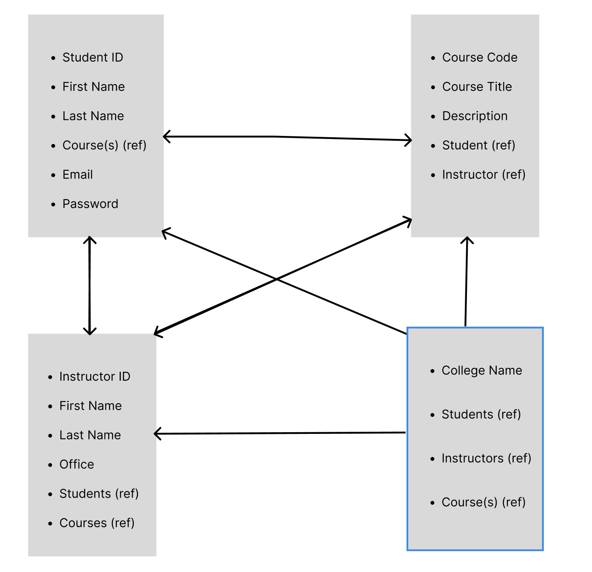
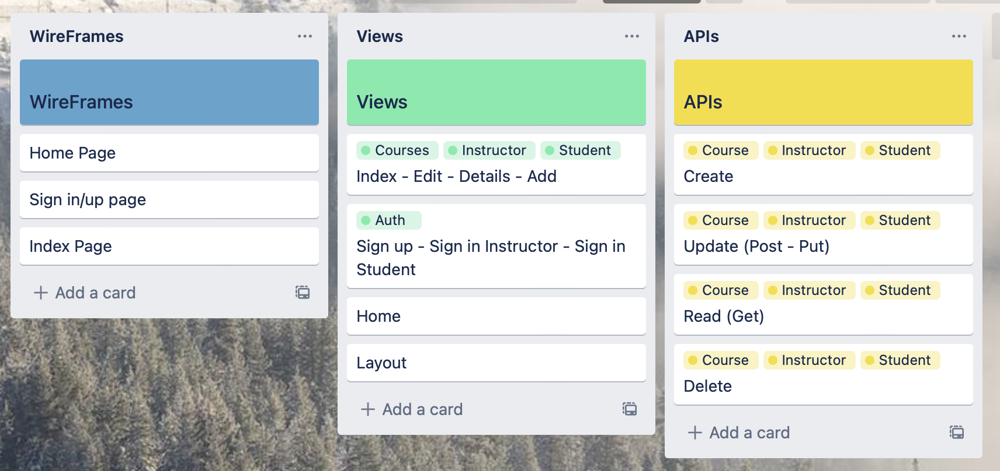

# ERD:

# Wireframes: 
[Wireframes for GAU](https://www.figma.com/file/qI4K9yGw3vIFlGvQwQeMxV/General-Assembly-University?node-id=1%3A4&t=DjuqyuTayRvB4EO9-0)
# Trello:

# Link to your deployed application.
[General Assembly University](https://app.cyclic.sh/#/app/isolate77-gau/overview)
# List of unsolved problems.
* Login verification for Students
* Major Section

# Future enhancements.
* Styling
* Have better links between models
* Lock certain features behind proper authentication wall.
* Logged in user can change their own info rather than others too.
